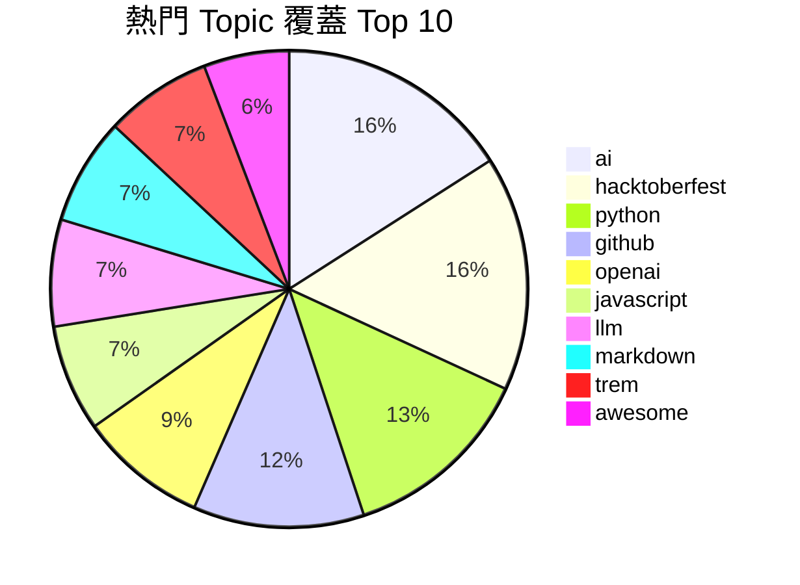
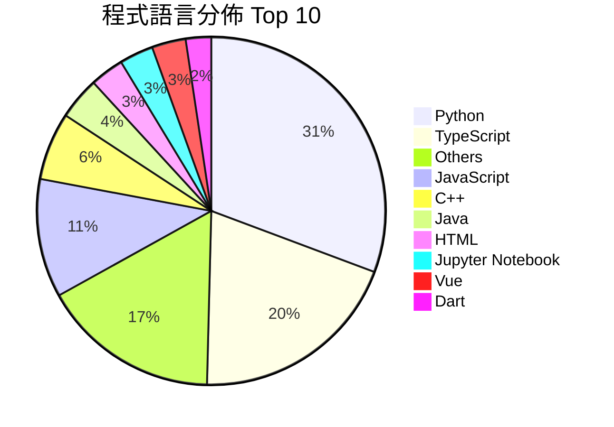

# Andy87877 的 GitHub Stars

> 收錄 **156** 個公開 Star；資料快照：`2026-08-21 18:22:13 (UTC+8)`。來源：[Andy87877 的 GitHub Stars](https://github.com/Andy87877?tab=stars)。

這是一個不需要資料庫的 GitHub Star 個人知識庫：Python 同步器負責抓取與產生靜態資料，網站則提供即時搜尋、聚焦 Topic、語言篩選、Table（預設）／Cards 雙模式、最愛 ⭐ 標註、動態分頁、數據分析 Dashboard、排序、本機研究筆記與 CSV 匯出。

## 📊 數據圖表與統計視覺化

### 熱門 Topic 覆蓋 (Top 10)



### 程式語言分佈 (Top 10)



### 熱門 Topic 涵蓋專案進度條

| Topic 標籤 | 涵蓋專案數 | 視覺化進度條 |
| :--- | :---: | :--- |
| **#ai** | 11 筆 (7.1%) | `███` |
| **#hacktoberfest** | 11 筆 (7.1%) | `███` |
| **#python** | 9 筆 (5.8%) | `██` |
| **#github** | 8 筆 (5.1%) | `██` |
| **#openai** | 6 筆 (3.8%) | `██` |
| **#javascript** | 5 筆 (3.2%) | `█` |
| **#llm** | 5 筆 (3.2%) | `█` |
| **#markdown** | 5 筆 (3.2%) | `█` |
| **#trem** | 5 筆 (3.2%) | `█` |
| **#awesome** | 4 筆 (2.6%) | `█` |

## 資料即時性與數據分析

- 網站開啟時先顯示版本庫快照，再讀取 GitHub 公開 REST API 更新畫面；若 API 暫時不可用，會清楚標示目前仍是快照。
- 點擊導覽列「📊 數據分析」可開啟數據 Dashboard，以視覺化圖表與進度條檢視程式語言分佈 (Top 10)、熱門 Topics (Top 15) 與 Star 年度收藏趨勢。
- `Refresh GitHub Stars snapshot` workflow 每日 03:00（Asia/Taipei）及手動觸發同步本 README、`language.md` 與 `web/data/stars.json`。
- 每次 push／pull request 都先執行 Robot 驗收；`main` 驗證成功後才打包純靜態網站並部署 GitHub Pages。
- 同步採失敗關閉策略：API 錯誤、分頁不完整或取得 0 筆時，不會覆寫上一份有效資料。
- 原始資料共有 **502** 個 Topics；本 README 依 Focus Topic 原則精選 **30** 個高頻標籤，未命中聚焦標籤的專案收進最底下的 `other` （**93** 個 repositories）。

## 特別感謝

特別感謝 [goodjack/stars](https://github.com/goodjack/stars) 提供 GitHub Stars 自動擷取、分類並產生 Markdown 清單的實作靈感，讓我有做這個專案的想法；本專案再延伸為 OOP／SOLID／MVC 架構、Table 優先網站、數據分析 Dashboard、即時資料狀態與 Robot Framework 驗收。

## 使用方式

```powershell
python -m pip install -r config/requirements.txt
python main.py --username Andy87877
python main.py --serve
python main.py --analytics
python main.py --export csv
```

瀏覽 `http://127.0.0.1:8000`。執行 Robot Framework 驗收測試：

```powershell
python -m robot --outputdir artifacts/robot-reports tests
```

## 架構摘要

- Python：`Repository` Model、`AnalyticsCalculator` (SRP 數據計算服務)、可替換 GitHub Client／分類／渲染策略、`SyncController`、原子檔案發布器。
- JavaScript：`StarModel`、`StarView`、`StarController` 前端 MVC，支援最愛⭐標註、動態分頁與 📊 數據分析 Dashboard。
- 詳細設計、演進、待辦與協作規範分別見 `docs/architecture.md`、`docs/iterate.md`、`docs/task.md`、`docs/AGENT.md`。

## 📄 授權條款 (License)

本專案採用 [CC0-1.0 Universal License (CC0 1.0 公眾領域貢獻宣告)](LICENSE) 授權。您可以自由複製、修改、發布與發行本專案內容，包含商業用途，無需事先獲得許可。

## 依 Focus Topic 瀏覽

👉 **另有以主要程式語言分類的專屬文件**：[按主要程式語言瀏覽 (language.md)](language.md)

- [ai（11）](#topic-ai)
- [hacktoberfest（11）](#topic-hacktoberfest)
- [python（9）](#topic-python)
- [github（8）](#topic-github)
- [openai（6）](#topic-openai)
- [javascript（5）](#topic-javascript)
- [llm（5）](#topic-llm)
- [markdown（5）](#topic-markdown)
- [trem（5）](#topic-trem)
- [awesome（4）](#topic-awesome)
- [deep-learning（4）](#topic-deep-learning)
- [earthquake（4）](#topic-earthquake)
- [earthquake-early-warning（4）](#topic-earthquake-early-warning)
- [ntut（4）](#topic-ntut)
- [profile-readme（4）](#topic-profile-readme)
- [readme（4）](#topic-readme)
- [taiwan（4）](#topic-taiwan)
- [awesome-list（3）](#topic-awesome-list)
- [chatgpt（3）](#topic-chatgpt)
- [cross-platform（3）](#topic-cross-platform)
- [css（3）](#topic-css)
- [frontend（3）](#topic-frontend)
- [github-profile（3）](#topic-github-profile)
- [machine-learning（3）](#topic-machine-learning)
- [mcp（3）](#topic-mcp)
- [nextjs（3）](#topic-nextjs)
- [nodejs（3）](#topic-nodejs)
- [readme-stats（3）](#topic-readme-stats)
- [security（3）](#topic-security)
- [tts（3）](#topic-tts)
- [other（93）](#topic-other)

---

<a id="topic-ai"></a>

## ai

- [microsoft/AI-For-Beginners](https://github.com/microsoft/AI-For-Beginners) — 12 Weeks, 24 Lessons, AI for All!
- [Infrasys-AI/AISystem](https://github.com/Infrasys-AI/AISystem) — AISystem 主要是指AI系统，包括AI芯片、AI编译器、AI推理和训练框架等AI全栈底层技术
- [arturitu/the-delegation](https://github.com/arturitu/the-delegation) — A no-code 3D playground to explore, design, and interact with Agentic AI systems
- [supabase/supabase](https://github.com/supabase/supabase) — The Postgres development platform. Supabase gives you a dedicated Postgres database to build your web, mobile, and AI applications.
- [openclaw/openclaw](https://github.com/openclaw/openclaw) — Your own personal AI assistant. Any OS. Any Platform. The lobster way. 🦞
- [langgenius/dify](https://github.com/langgenius/dify) — Build Agentic workflows, RAG pipelines, with rich AI model and tool support on one collaborative workspace. Deploy on cloud, VPC, or self-hosted, so teams move from prototype to production without rebuilding the stack.
- [AsyncFuncAI/deepwiki-open](https://github.com/AsyncFuncAI/deepwiki-open) — Open Source DeepWiki: AI-Powered Wiki Generator for GitHub/Gitlab/Bitbucket Repositories. Join the discord: https://discord.gg/gMwThUMeme
- [github/awesome-copilot](https://github.com/github/awesome-copilot) — Community-contributed instructions, agents, skills, and configurations to help you make the most of GitHub Copilot.
- [microsoft/vscode-copilot-release](https://github.com/microsoft/vscode-copilot-release) — Feedback on GitHub Copilot Chat UX in Visual Studio Code.
- [f/prompts.chat](https://github.com/f/prompts.chat) — f.k.a. Awesome ChatGPT Prompts. Share, discover, and collect prompts from the community. Free and open source — self-host for your organization with complete privacy.
- [ponlponl123/-Prototype-AIVTuber](https://github.com/ponlponl123/-Prototype-AIVTuber) — a open-source Artificial Intelligence Virtual Youtuber (AI VTuber), (this project is deprecated)

<a id="topic-hacktoberfest"></a>

## hacktoberfest

- [excalidraw/excalidraw](https://github.com/excalidraw/excalidraw) — Virtual whiteboard for sketching hand-drawn like diagrams
- [swisskyrepo/PayloadsAllTheThings](https://github.com/swisskyrepo/PayloadsAllTheThings) — A list of useful payloads and bypass for Web Application Security and Pentest/CTF
- [github/awesome-copilot](https://github.com/github/awesome-copilot) — Community-contributed instructions, agents, skills, and configurations to help you make the most of GitHub Copilot.
- [cloudflare/cloudflare-docs](https://github.com/cloudflare/cloudflare-docs) — Cloudflare’s documentation
- [miantiao-me/loooooooooooooooooooooooooooooooooooooooooooooooooooooooooooooo.ong](https://github.com/miantiao-me/loooooooooooooooooooooooooooooooooooooooooooooooooooooooooooooo.ong) — Make your URL looooooooooooooooooooooooooooooooooooooooooooooooooooooooooooooonger
- [DenverCoder1/github-readme-streak-stats](https://github.com/DenverCoder1/github-readme-streak-stats) — 🔥 Stay motivated and show off your contribution streak! 🌟 Display your total contributions, current streak, and longest streak on your GitHub profile README
- [NEO-TAT/tat_flutter](https://github.com/NEO-TAT/tat_flutter) — An App for Taipei Tech students. NTUT Life TAT, convenient, concise, fast, powerful, enrich your NTUT life!
- [vn7n24fzkq/github-profile-summary-cards](https://github.com/vn7n24fzkq/github-profile-summary-cards) — A tool to generate your GitHub summary card for profile README
- [rahuldkjain/github-profile-readme-generator](https://github.com/rahuldkjain/github-profile-readme-generator) — 🚀 Generate GitHub profile README easily with the latest add-ons like visitors count, GitHub stats, etc using minimal UI.
- [ChatTriggers/ChatTriggers](https://github.com/ChatTriggers/ChatTriggers) — A framework for Minecraft Forge that allows for client modifications to be scripted in JavaScript
- [Ashutosh00710/github-readme-activity-graph](https://github.com/Ashutosh00710/github-readme-activity-graph) — A dynamically generated activity graph to show your GitHub activities of last 31 days.

<a id="topic-python"></a>

## python

- [robotframework/robotframework](https://github.com/robotframework/robotframework) — Generic automation framework for acceptance testing and RPA
- [facebook/prophet](https://github.com/facebook/prophet) — Tool for producing high quality forecasts for time series data that has multiple seasonality with linear or non-linear growth.
- [originalankur/maptoposter](https://github.com/originalankur/maptoposter) — Transform your favorite cities into beautiful, minimalist designs. MapToPoster lets you create and export visually striking map posters with code.
- [521xueweihan/HelloGitHub](https://github.com/521xueweihan/HelloGitHub) — :octocat: 分享 GitHub 上有趣、入门级的开源项目。Share interesting, entry-level open source projects on GitHub.
- [langgenius/dify](https://github.com/langgenius/dify) — Build Agentic workflows, RAG pipelines, with rich AI model and tool support on one collaborative workspace. Deploy on cloud, VPC, or self-hosted, so teams move from prototype to production without rebuilding the stack.
- [vinta/awesome-python](https://github.com/vinta/awesome-python) — The definitive list that answers "I want to do X in Python, which tool should I use?"
- [cgoldberg/python-unittest-tutorial](https://github.com/cgoldberg/python-unittest-tutorial) — Python tutorial - unittest module
- [gradio-app/gradio](https://github.com/gradio-app/gradio) — Build and share delightful machine learning apps, all in Python. 🌟 Star to support our work!
- [joelibaceta/video-to-ascii](https://github.com/joelibaceta/video-to-ascii) — It is a simple python package to play videos in the terminal using characters as pixels

<a id="topic-github"></a>

## github

- [521xueweihan/HelloGitHub](https://github.com/521xueweihan/HelloGitHub) — :octocat: 分享 GitHub 上有趣、入门级的开源项目。Share interesting, entry-level open source projects on GitHub.
- [AsyncFuncAI/deepwiki-open](https://github.com/AsyncFuncAI/deepwiki-open) — Open Source DeepWiki: AI-Powered Wiki Generator for GitHub/Gitlab/Bitbucket Repositories. Join the discord: https://discord.gg/gMwThUMeme
- [github/github-mcp-server](https://github.com/github/github-mcp-server) — GitHub's official MCP Server
- [DenverCoder1/github-readme-streak-stats](https://github.com/DenverCoder1/github-readme-streak-stats) — 🔥 Stay motivated and show off your contribution streak! 🌟 Display your total contributions, current streak, and longest streak on your GitHub profile README
- [Schweinepriester/github-profile-achievements](https://github.com/Schweinepriester/github-profile-achievements) — A collection listing all Achievements available on the GitHub profile 🏆
- [avgupta456/github-trends](https://github.com/avgupta456/github-trends) — 🚀 Level up your GitHub profile readme with customizable cards including LOC statistics!
- [rahuldkjain/github-profile-readme-generator](https://github.com/rahuldkjain/github-profile-readme-generator) — 🚀 Generate GitHub profile README easily with the latest add-ons like visitors count, GitHub stats, etc using minimal UI.
- [rzashakeri/beautify-github-profile](https://github.com/rzashakeri/beautify-github-profile) — This repository will assist you in creating a more beautiful and appealing github profile, and you will have access to a comprehensive range of tools and tutorials for beautifying your github profile. 🪄 ⭐

<a id="topic-openai"></a>

## openai

- [openai/codex-security](https://github.com/openai/codex-security) — OpenAI's Codex Security CLI and TypeScript SDK for finding, validating, and fixing security vulnerabilities. npm: https://www.npmjs.com/package/@openai/codex-security
- [langgenius/dify](https://github.com/langgenius/dify) — Build Agentic workflows, RAG pipelines, with rich AI model and tool support on one collaborative workspace. Deploy on cloud, VPC, or self-hosted, so teams move from prototype to production without rebuilding the stack.
- [AsyncFuncAI/deepwiki-open](https://github.com/AsyncFuncAI/deepwiki-open) — Open Source DeepWiki: AI-Powered Wiki Generator for GitHub/Gitlab/Bitbucket Repositories. Join the discord: https://discord.gg/gMwThUMeme
- [0xk1h0/ChatGPT_DAN](https://github.com/0xk1h0/ChatGPT_DAN) — ChatGPT DAN, Jailbreaks prompt
- [f/prompts.chat](https://github.com/f/prompts.chat) — f.k.a. Awesome ChatGPT Prompts. Share, discover, and collect prompts from the community. Free and open source — self-host for your organization with complete privacy.
- [ponlponl123/-Prototype-AIVTuber](https://github.com/ponlponl123/-Prototype-AIVTuber) — a open-source Artificial Intelligence Virtual Youtuber (AI VTuber), (this project is deprecated)

<a id="topic-javascript"></a>

## javascript

- [thedaviddias/Front-End-Checklist](https://github.com/thedaviddias/Front-End-Checklist) — 🗂 The essential checklist for modern web development, for humans and AI agents
- [freeCodeCamp/freeCodeCamp](https://github.com/freeCodeCamp/freeCodeCamp) — freeCodeCamp.org's open-source codebase and curriculum. Learn math, programming, and computer science for free.
- [ponlponl123/-Prototype-AIVTuber](https://github.com/ponlponl123/-Prototype-AIVTuber) — a open-source Artificial Intelligence Virtual Youtuber (AI VTuber), (this project is deprecated)
- [twbs/bootstrap](https://github.com/twbs/bootstrap) — The most popular HTML, CSS, and JavaScript framework for developing responsive, mobile first projects on the web.
- [liyupi/sql-generator](https://github.com/liyupi/sql-generator) — 🔨 用 JSON 来生成结构化的 SQL 语句，基于 Vue3 + TypeScript + Vite + Ant Design + MonacoEditor 实现，项目简单（重逻辑轻页面）、适合练手~

<a id="topic-llm"></a>

## llm

- [bojieli/ai-agent-book](https://github.com/bojieli/ai-agent-book) — 《深入理解 AI Agent：设计原理与工程实践》（李博杰 著）开源主仓库：全书正文、编译版 PDF 与按章配套代码
- [langgenius/dify](https://github.com/langgenius/dify) — Build Agentic workflows, RAG pipelines, with rich AI model and tool support on one collaborative workspace. Deploy on cloud, VPC, or self-hosted, so teams move from prototype to production without rebuilding the stack.
- [microsoft/poml](https://github.com/microsoft/poml) — Prompt Orchestration Markup Language
- [MiuLab/Taiwan-LLM](https://github.com/MiuLab/Taiwan-LLM) — Traditional Mandarin LLMs for Taiwan
- [f/prompts.chat](https://github.com/f/prompts.chat) — f.k.a. Awesome ChatGPT Prompts. Share, discover, and collect prompts from the community. Free and open source — self-host for your organization with complete privacy.

<a id="topic-markdown"></a>

## markdown

- [cloudflare/cloudflare-docs](https://github.com/cloudflare/cloudflare-docs) — Cloudflare’s documentation
- [sparanoid/chinese-copywriting-guidelines](https://github.com/sparanoid/chinese-copywriting-guidelines) — Chinese copywriting guidelines for better written communication／中文文案排版指北
- [kwchang0831/svelte-QWER](https://github.com/kwchang0831/svelte-QWER) — ✒︎ Simply Awesome Blog Starter built with SvelteKit and Love ❤
- [rahuldkjain/github-profile-readme-generator](https://github.com/rahuldkjain/github-profile-readme-generator) — 🚀 Generate GitHub profile README easily with the latest add-ons like visitors count, GitHub stats, etc using minimal UI.
- [rzashakeri/beautify-github-profile](https://github.com/rzashakeri/beautify-github-profile) — This repository will assist you in creating a more beautiful and appealing github profile, and you will have access to a comprehensive range of tools and tutorials for beautifying your github profile. 🪄 ⭐

<a id="topic-trem"></a>

## trem

- [ExpTechTW/TREM-Lite](https://github.com/ExpTechTW/TREM-Lite) — Taiwan Real-time Earthquake Monitoring (Lite)
- [ExpTechTW/DPIP](https://github.com/ExpTechTW/DPIP) — Disaster Prevention Information Platform (防災資訊整合平台)
- [ExpTechTW/TREM-tauri](https://github.com/ExpTechTW/TREM-tauri) — Taiwan Real-time Earthquake Monitoring（臺灣即時地震監測）
- [ExpTechTW/TREM-Lite-v2](https://github.com/ExpTechTW/TREM-Lite-v2) — Taiwan Real-time Earthquake Monitoring Lite ( 臺灣即時地震監測 輕量版 )
- [ExpTechTW/TREM-electron](https://github.com/ExpTechTW/TREM-electron) — Taiwan Real-time Earthquake Monitoring ( 臺灣即時地震監測 )

<a id="topic-awesome"></a>

## awesome

- [521xueweihan/HelloGitHub](https://github.com/521xueweihan/HelloGitHub) — :octocat: 分享 GitHub 上有趣、入门级的开源项目。Share interesting, entry-level open source projects on GitHub.
- [vinta/awesome-python](https://github.com/vinta/awesome-python) — The definitive list that answers "I want to do X in Python, which tool should I use?"
- [github/awesome-copilot](https://github.com/github/awesome-copilot) — Community-contributed instructions, agents, skills, and configurations to help you make the most of GitHub Copilot.
- [deepseek-ai/awesome-deepseek-integration](https://github.com/deepseek-ai/awesome-deepseek-integration) — Integrate the DeepSeek API into popular software

<a id="topic-deep-learning"></a>

## deep-learning

- [microsoft/AI-For-Beginners](https://github.com/microsoft/AI-For-Beginners) — 12 Weeks, 24 Lessons, AI for All!
- [erhwenkuo/deep-learning-with-keras-notebooks](https://github.com/erhwenkuo/deep-learning-with-keras-notebooks) — Jupyter notebooks for using & learning Keras
- [AlexeyAB/darknet](https://github.com/AlexeyAB/darknet) — YOLOv4 / Scaled-YOLOv4 / YOLO - Neural Networks for Object Detection (Windows and Linux version of Darknet )
- [gradio-app/gradio](https://github.com/gradio-app/gradio) — Build and share delightful machine learning apps, all in Python. 🌟 Star to support our work!

<a id="topic-earthquake"></a>

## earthquake

- [ExpTechTW/TREM-Lite](https://github.com/ExpTechTW/TREM-Lite) — Taiwan Real-time Earthquake Monitoring (Lite)
- [ExpTechTW/TREM-tauri](https://github.com/ExpTechTW/TREM-tauri) — Taiwan Real-time Earthquake Monitoring（臺灣即時地震監測）
- [ExpTechTW/TREM-Lite-v2](https://github.com/ExpTechTW/TREM-Lite-v2) — Taiwan Real-time Earthquake Monitoring Lite ( 臺灣即時地震監測 輕量版 )
- [ExpTechTW/TREM-electron](https://github.com/ExpTechTW/TREM-electron) — Taiwan Real-time Earthquake Monitoring ( 臺灣即時地震監測 )

<a id="topic-earthquake-early-warning"></a>

## earthquake-early-warning

- [ExpTechTW/TREM-Lite](https://github.com/ExpTechTW/TREM-Lite) — Taiwan Real-time Earthquake Monitoring (Lite)
- [ExpTechTW/TREM-tauri](https://github.com/ExpTechTW/TREM-tauri) — Taiwan Real-time Earthquake Monitoring（臺灣即時地震監測）
- [ExpTechTW/TREM-Lite-v2](https://github.com/ExpTechTW/TREM-Lite-v2) — Taiwan Real-time Earthquake Monitoring Lite ( 臺灣即時地震監測 輕量版 )
- [ExpTechTW/TREM-electron](https://github.com/ExpTechTW/TREM-electron) — Taiwan Real-time Earthquake Monitoring ( 臺灣即時地震監測 )

<a id="topic-ntut"></a>

## ntut

- [NTUT-NPC/ntut-sso-plus](https://github.com/NTUT-NPC/ntut-sso-plus) — 北科校園入口 Chrome / Firefox 擴充功能
- [ntut-open-source-club/practical-tools-for-simple-design](https://github.com/ntut-open-source-club/practical-tools-for-simple-design) — A Game Framework for NTUT OOPL Course
- [NEO-TAT/tat_flutter](https://github.com/NEO-TAT/tat_flutter) — An App for Taipei Tech students. NTUT Life TAT, convenient, concise, fast, powerful, enrich your NTUT life!
- [gnehs/ntut-course-web](https://github.com/gnehs/ntut-course-web) — 這裡是北科課程好朋友，提供使用者以輕鬆的方式查詢與檢視課程資訊！

<a id="topic-profile-readme"></a>

## profile-readme

- [DenverCoder1/github-readme-streak-stats](https://github.com/DenverCoder1/github-readme-streak-stats) — 🔥 Stay motivated and show off your contribution streak! 🌟 Display your total contributions, current streak, and longest streak on your GitHub profile README
- [vn7n24fzkq/github-profile-summary-cards](https://github.com/vn7n24fzkq/github-profile-summary-cards) — A tool to generate your GitHub summary card for profile README
- [avgupta456/github-trends](https://github.com/avgupta456/github-trends) — 🚀 Level up your GitHub profile readme with customizable cards including LOC statistics!
- [rzashakeri/beautify-github-profile](https://github.com/rzashakeri/beautify-github-profile) — This repository will assist you in creating a more beautiful and appealing github profile, and you will have access to a comprehensive range of tools and tutorials for beautifying your github profile. 🪄 ⭐

<a id="topic-readme"></a>

## readme

- [DenverCoder1/github-readme-streak-stats](https://github.com/DenverCoder1/github-readme-streak-stats) — 🔥 Stay motivated and show off your contribution streak! 🌟 Display your total contributions, current streak, and longest streak on your GitHub profile README
- [rahuldkjain/github-profile-readme-generator](https://github.com/rahuldkjain/github-profile-readme-generator) — 🚀 Generate GitHub profile README easily with the latest add-ons like visitors count, GitHub stats, etc using minimal UI.
- [rzashakeri/beautify-github-profile](https://github.com/rzashakeri/beautify-github-profile) — This repository will assist you in creating a more beautiful and appealing github profile, and you will have access to a comprehensive range of tools and tutorials for beautifying your github profile. 🪄 ⭐
- [Ashutosh00710/github-readme-activity-graph](https://github.com/Ashutosh00710/github-readme-activity-graph) — A dynamically generated activity graph to show your GitHub activities of last 31 days.

<a id="topic-taiwan"></a>

## taiwan

- [MiuLab/Taiwan-LLM](https://github.com/MiuLab/Taiwan-LLM) — Traditional Mandarin LLMs for Taiwan
- [ExpTechTW/TREM-tauri](https://github.com/ExpTechTW/TREM-tauri) — Taiwan Real-time Earthquake Monitoring（臺灣即時地震監測）
- [Ice1187/TW-Security-and-CTF-Resource](https://github.com/Ice1187/TW-Security-and-CTF-Resource) — 台灣資安 / CTF 學習資源整理
- [goodjack/developer-roadmap-chinese](https://github.com/goodjack/developer-roadmap-chinese) — 2021 年成為 Web 開發人員的路線圖 台灣正體中文版

<a id="topic-awesome-list"></a>

## awesome-list

- [codecrafters-io/build-your-own-x](https://github.com/codecrafters-io/build-your-own-x) — Master programming by recreating your favorite technologies from scratch.
- [ripienaar/free-for-dev](https://github.com/ripienaar/free-for-dev) — A list of SaaS, PaaS and IaaS offerings that have free tiers of interest to devops and infradev
- [f/prompts.chat](https://github.com/f/prompts.chat) — f.k.a. Awesome ChatGPT Prompts. Share, discover, and collect prompts from the community. Free and open source — self-host for your organization with complete privacy.

<a id="topic-chatgpt"></a>

## chatgpt

- [JimmyLv/awesome-nano-banana](https://github.com/JimmyLv/awesome-nano-banana) — Awesome curated collection of images and prompts generated by gemini-2.5-flash-image (aka Nano Banana) state-of-the-art image generation and editing model. Explore AI generated visuals created with Gemini, showcasing Google’s advanced imag…
- [0xk1h0/ChatGPT_DAN](https://github.com/0xk1h0/ChatGPT_DAN) — ChatGPT DAN, Jailbreaks prompt
- [f/prompts.chat](https://github.com/f/prompts.chat) — f.k.a. Awesome ChatGPT Prompts. Share, discover, and collect prompts from the community. Free and open source — self-host for your organization with complete privacy.

<a id="topic-cross-platform"></a>

## cross-platform

- [ntut-open-source-club/practical-tools-for-simple-design](https://github.com/ntut-open-source-club/practical-tools-for-simple-design) — A Game Framework for NTUT OOPL Course
- [ExpTechTW/TREM-Lite](https://github.com/ExpTechTW/TREM-Lite) — Taiwan Real-time Earthquake Monitoring (Lite)
- [ExpTechTW/TREM-tauri](https://github.com/ExpTechTW/TREM-tauri) — Taiwan Real-time Earthquake Monitoring（臺灣即時地震監測）

<a id="topic-css"></a>

## css

- [thedaviddias/Front-End-Checklist](https://github.com/thedaviddias/Front-End-Checklist) — 🗂 The essential checklist for modern web development, for humans and AI agents
- [sparanoid/chinese-copywriting-guidelines](https://github.com/sparanoid/chinese-copywriting-guidelines) — Chinese copywriting guidelines for better written communication／中文文案排版指北
- [twbs/bootstrap](https://github.com/twbs/bootstrap) — The most popular HTML, CSS, and JavaScript framework for developing responsive, mobile first projects on the web.

<a id="topic-frontend"></a>

## frontend

- [thedaviddias/Front-End-Checklist](https://github.com/thedaviddias/Front-End-Checklist) — 🗂 The essential checklist for modern web development, for humans and AI agents
- [Vincent550102/nPassword](https://github.com/Vincent550102/nPassword) — A Windows AD Password Manager for ATTACKER(Redteamer/Pentester).
- [goodjack/developer-roadmap-chinese](https://github.com/goodjack/developer-roadmap-chinese) — 2021 年成為 Web 開發人員的路線圖 台灣正體中文版

<a id="topic-github-profile"></a>

## github-profile

- [DenverCoder1/github-readme-streak-stats](https://github.com/DenverCoder1/github-readme-streak-stats) — 🔥 Stay motivated and show off your contribution streak! 🌟 Display your total contributions, current streak, and longest streak on your GitHub profile README
- [Schweinepriester/github-profile-achievements](https://github.com/Schweinepriester/github-profile-achievements) — A collection listing all Achievements available on the GitHub profile 🏆
- [rzashakeri/beautify-github-profile](https://github.com/rzashakeri/beautify-github-profile) — This repository will assist you in creating a more beautiful and appealing github profile, and you will have access to a comprehensive range of tools and tutorials for beautifying your github profile. 🪄 ⭐

<a id="topic-machine-learning"></a>

## machine-learning

- [microsoft/AI-For-Beginners](https://github.com/microsoft/AI-For-Beginners) — 12 Weeks, 24 Lessons, AI for All!
- [gradio-app/gradio](https://github.com/gradio-app/gradio) — Build and share delightful machine learning apps, all in Python. 🌟 Star to support our work!
- [f/prompts.chat](https://github.com/f/prompts.chat) — f.k.a. Awesome ChatGPT Prompts. Share, discover, and collect prompts from the community. Free and open source — self-host for your organization with complete privacy.

<a id="topic-mcp"></a>

## mcp

- [bojieli/ai-agent-book](https://github.com/bojieli/ai-agent-book) — 《深入理解 AI Agent：设计原理与工程实践》（李博杰 著）开源主仓库：全书正文、编译版 PDF 与按章配套代码
- [langgenius/dify](https://github.com/langgenius/dify) — Build Agentic workflows, RAG pipelines, with rich AI model and tool support on one collaborative workspace. Deploy on cloud, VPC, or self-hosted, so teams move from prototype to production without rebuilding the stack.
- [github/github-mcp-server](https://github.com/github/github-mcp-server) — GitHub's official MCP Server

<a id="topic-nextjs"></a>

## nextjs

- [supabase/supabase](https://github.com/supabase/supabase) — The Postgres development platform. Supabase gives you a dedicated Postgres database to build your web, mobile, and AI applications.
- [langgenius/dify](https://github.com/langgenius/dify) — Build Agentic workflows, RAG pipelines, with rich AI model and tool support on one collaborative workspace. Deploy on cloud, VPC, or self-hosted, so teams move from prototype to production without rebuilding the stack.
- [f/prompts.chat](https://github.com/f/prompts.chat) — f.k.a. Awesome ChatGPT Prompts. Share, discover, and collect prompts from the community. Free and open source — self-host for your organization with complete privacy.

<a id="topic-nodejs"></a>

## nodejs

- [openai/codex-security](https://github.com/openai/codex-security) — OpenAI's Codex Security CLI and TypeScript SDK for finding, validating, and fixing security vulnerabilities. npm: https://www.npmjs.com/package/@openai/codex-security
- [freeCodeCamp/freeCodeCamp](https://github.com/freeCodeCamp/freeCodeCamp) — freeCodeCamp.org's open-source codebase and curriculum. Learn math, programming, and computer science for free.
- [ponlponl123/-Prototype-AIVTuber](https://github.com/ponlponl123/-Prototype-AIVTuber) — a open-source Artificial Intelligence Virtual Youtuber (AI VTuber), (this project is deprecated)

<a id="topic-readme-stats"></a>

## readme-stats

- [DenverCoder1/github-readme-streak-stats](https://github.com/DenverCoder1/github-readme-streak-stats) — 🔥 Stay motivated and show off your contribution streak! 🌟 Display your total contributions, current streak, and longest streak on your GitHub profile README
- [vn7n24fzkq/github-profile-summary-cards](https://github.com/vn7n24fzkq/github-profile-summary-cards) — A tool to generate your GitHub summary card for profile README
- [avgupta456/github-trends](https://github.com/avgupta456/github-trends) — 🚀 Level up your GitHub profile readme with customizable cards including LOC statistics!

<a id="topic-security"></a>

## security

- [openai/codex-security](https://github.com/openai/codex-security) — OpenAI's Codex Security CLI and TypeScript SDK for finding, validating, and fixing security vulnerabilities. npm: https://www.npmjs.com/package/@openai/codex-security
- [swisskyrepo/PayloadsAllTheThings](https://github.com/swisskyrepo/PayloadsAllTheThings) — A list of useful payloads and bypass for Web Application Security and Pentest/CTF
- [Ice1187/TW-Security-and-CTF-Resource](https://github.com/Ice1187/TW-Security-and-CTF-Resource) — 台灣資安 / CTF 學習資源整理

<a id="topic-tts"></a>

## tts

- [index-tts/index-tts](https://github.com/index-tts/index-tts) — An Industrial-Level Controllable and Efficient Zero-Shot Text-To-Speech System
- [RVC-Boss/GPT-SoVITS](https://github.com/RVC-Boss/GPT-SoVITS) — 1 min voice data can also be used to train a good TTS model! (few shot voice cloning)
- [ponlponl123/-Prototype-AIVTuber](https://github.com/ponlponl123/-Prototype-AIVTuber) — a open-source Artificial Intelligence Virtual Youtuber (AI VTuber), (this project is deprecated)

<a id="topic-other"></a>

## other

- [mahlernim/google-timeline-visualizer](https://github.com/mahlernim/google-timeline-visualizer) — Visualize your year in travel using your Google Location History (Timeline) data
- [FRC8725/FRC8725-Website-Design-Docs](https://github.com/FRC8725/FRC8725-Website-Design-Docs)
- [microsoft/clarity](https://github.com/microsoft/clarity) — A behavioral analytics library that uses dom mutations and user interactions to generate aggregated insights.
- [ForrestKnight/open-source-cs](https://github.com/ForrestKnight/open-source-cs) — Video discussing this curriculum:
- [jasoncheng7115/jt-live-whisper](https://github.com/jasoncheng7115/jt-live-whisper) — 100% 全地端 AI 語音工具集：即時轉錄、即時翻譯、錄音檔批次處理、講者辨識、會議摘要，所有 AI 模型皆在自有設備上運行，資料不經過任何雲端服務。
- [multica-ai/andrej-karpathy-skills](https://github.com/multica-ai/andrej-karpathy-skills) — A single CLAUDE.md file to improve Claude Code behavior, derived from Andrej Karpathy's observations on LLM coding pitfalls.
- [openai/whisper](https://github.com/openai/whisper) — Robust Speech Recognition via Large-Scale Weak Supervision
- [bschen410/ticket-platform](https://github.com/bschen410/ticket-platform)
- [AuricTW/Ceylantify-YouTube](https://github.com/AuricTW/Ceylantify-YouTube) — 你的YT不需要其他插件，唯獨 Ceylantify-YouTube 你必須擁有。 Your YouTube Doesn't Need Plugins, But Ceylantify-YouTube is a must-have.
- [cyizhuo/CIFAR-100-dataset](https://github.com/cyizhuo/CIFAR-100-dataset) — CIFAR-100 dataset by classes folder
- [Jcw87/c2-smb1](https://github.com/Jcw87/c2-smb1) — Super Mario Bros Clone
- [MitchellSternke/SuperMarioBros-C](https://github.com/MitchellSternke/SuperMarioBros-C) — An attempt to translate the original Super Mario Bros. for the NES to readable C/C++
- [massgravel/Microsoft-Activation-Scripts](https://github.com/massgravel/Microsoft-Activation-Scripts) — Open-source Windows and Office activator featuring HWID, Ohook, TSforge, and Online KMS activation methods, along with advanced troubleshooting.
- [Jack-Development/SuperMarioBros-CSharp-Remake](https://github.com/Jack-Development/SuperMarioBros-CSharp-Remake) — A project that recreates the classic Super Mario Bros game using C# and Visual Studio's Windows Forms Application platform. A modern interpretation of a timeless classic!
- [ntut-open-source-club/ptsd-template](https://github.com/ntut-open-source-club/ptsd-template)
- [ntut-open-source-club/PTSD-Practice-Giraffe-Adventure](https://github.com/ntut-open-source-club/PTSD-Practice-Giraffe-Adventure)
- [XWJWPIY/traffic_estimator](https://github.com/XWJWPIY/traffic_estimator)
- [pixel-agents-hq/pixel-agents](https://github.com/pixel-agents-hq/pixel-agents) — Pixel office.
- [doggy8088/Apptopia](https://github.com/doggy8088/Apptopia) — 用 Issue 許願，我會用 AI 幫你完成實作
- [Infatoshi/cuda-course](https://github.com/Infatoshi/cuda-course)
- [fxsjy/jieba](https://github.com/fxsjy/jieba) — 结巴中文分词
- [sitcon-tw/tickets](https://github.com/sitcon-tw/tickets) — SITCON 報名系統
- [scott0127/pik_tool](https://github.com/scott0127/pik_tool)
- [06wuuntt/NTUT_Coursesystem](https://github.com/06wuuntt/NTUT_Coursesystem)
- [gab61201/NTUT-iSchoolMate](https://github.com/gab61201/NTUT-iSchoolMate)
- [cyesuta/Code-Guardian-Aegis](https://github.com/cyesuta/Code-Guardian-Aegis) — VibeCoding security shield for novice developers - preventing disaster-level security vulnerabilities
- [google/googletest](https://github.com/google/googletest) — GoogleTest - Google Testing and Mocking Framework
- [SR0725/short-link-tracker](https://github.com/SR0725/short-link-tracker)
- [Demizo/Daily_You](https://github.com/Demizo/Daily_You) — Daily diary & journaling app
- [cyprieng/github-breakout](https://github.com/cyprieng/github-breakout) — Generate a Breakout game SVG from a GitHub user's contributions graph
- [xyTom/snippai](https://github.com/xyTom/snippai) — Snip Anything Solve Everything​
- [abyesilyurt/vibesort](https://github.com/abyesilyurt/vibesort) — GPT powered sorting using structured output
- [hangwin/mcp-chrome](https://github.com/hangwin/mcp-chrome) — Chrome MCP Server is a Chrome extension-based Model Context Protocol (MCP) server that exposes your Chrome browser functionality to AI assistants like Claude, enabling complex browser automation, content analysis, and semantic search.
- [expressvpn/lightway](https://github.com/expressvpn/lightway) — Lightway Rust Open Source Workspace
- [m4xshen/hardtime.nvim](https://github.com/m4xshen/hardtime.nvim) — Break bad habits, master Vim motions
- [openai/gpt-oss](https://github.com/openai/gpt-oss) — gpt-oss-120b and gpt-oss-20b are two open-weight language models by OpenAI
- [gnehs/userscripts](https://github.com/gnehs/userscripts) — 勝勝寫的 userscript 都在這邊
- [goodjack/stars](https://github.com/goodjack/stars)
- [dataease/dataease](https://github.com/dataease/dataease) — 🔥 人人可用的开源 BI 工具，数据可视化神器。An open-source BI tool alternative to Tableau.
- [rebas-tw/rebas.tw-open-data](https://github.com/rebas-tw/rebas.tw-open-data) — 台灣棒球進階資料庫｜原始數據共享計劃
- [COSCUP/2025](https://github.com/COSCUP/2025) — Official page of COSCUP x RubyConf Taiwan 2025
- [modelcontextprotocol/servers](https://github.com/modelcontextprotocol/servers) — Model Context Protocol Servers
- [GitYCC/context-engineering-intro-zh](https://github.com/GitYCC/context-engineering-intro-zh) — Context engineering 是新的 Vibe Coding —— 它是讓 AI 程式助理真正發揮作用的關鍵方式。Claude Code 是目前最適合做這件事的工具，所以這個 repo 會以它為核心，但其實你也可以把這個策略應用在任何 AI 程式助理上！
- [anthropics/claude-code](https://github.com/anthropics/claude-code) — Claude Code is an agentic coding tool that lives in your terminal, understands your codebase, and helps you code faster by executing routine tasks, explaining complex code, and handling git workflows - all through natural language commands.
- [bschen410/TicketPlatform](https://github.com/bschen410/TicketPlatform)
- [joonspk-research/generative_agents](https://github.com/joonspk-research/generative_agents) — Generative Agents: Interactive Simulacra of Human Behavior
- [LYiHub/mad-professor-public](https://github.com/LYiHub/mad-professor-public) — An AI companion for reading papers.
- [Taro7221/MyBudgetApp](https://github.com/Taro7221/MyBudgetApp)
- [IaintHamburger/MathHub-Backend](https://github.com/IaintHamburger/MathHub-Backend) — MathHub Project
- [Siestea/Pygame-chess](https://github.com/Siestea/Pygame-chess)
- [Larryeng/Fall_detection](https://github.com/Larryeng/Fall_detection) — An early warning device for the elderly when they fall
- [YuCheng21/zuvio-rollcall](https://github.com/YuCheng21/zuvio-rollcall) — Zuvio 自動點名程式
- [XiangxinKong/manhuagui-downloader](https://github.com/XiangxinKong/manhuagui-downloader) — 漫画柜下载器，带图形界面，纯python。已打包exe，可直接运行
- [Yucheng0208/NTUT-Linear-Algebra-Course](https://github.com/Yucheng0208/NTUT-Linear-Algebra-Course) — NTUT CS Linear Algebra Files.
- [deepseek-ai/DeepSeek-V3](https://github.com/deepseek-ai/DeepSeek-V3)
- [eddy0117/NeverThinkAutoReply](https://github.com/eddy0117/NeverThinkAutoReply) — 多種智慧回覆模式，包括自動MyGO、正常、反駁、嘲諷，全程無需使用者動腦
- [chingyen06/Digital-Design-Verilog](https://github.com/chingyen06/Digital-Design-Verilog)
- [hneemann/Digital](https://github.com/hneemann/Digital) — A digital logic designer and circuit simulator.
- [free5gc/free5GLabs](https://github.com/free5gc/free5GLabs) — A series of hands-on labs to guide you to build the 5G networks.
- [NTUT-NPC/shorts](https://github.com/NTUT-NPC/shorts) — 短褲：一個極簡的短網址伺服器
- [XPRAMT/anime-any-to-24fps](https://github.com/XPRAMT/anime-any-to-24fps) — 移除重複幀，將30幀的動畫還原成24幀
- [MaxOhn/rosu-pp](https://github.com/MaxOhn/rosu-pp) — PP and star calculation for all osu! gamemodes
- [tetrio/issues](https://github.com/tetrio/issues) — Report issues and discuss improvements / feature requests around TETR.IO
- [ttymayor/ttymayor](https://github.com/ttymayor/ttymayor)
- [linyiLYi/bilibot](https://github.com/linyiLYi/bilibot) — A local chatbot fine-tuned by bilibili user comments.
- [torvalds/linux](https://github.com/torvalds/linux) — Linux kernel source tree
- [robsoncouto/arduino-songs](https://github.com/robsoncouto/arduino-songs)
- [yihong0618/SunoSongsCreator](https://github.com/yihong0618/SunoSongsCreator) — About High quality songs generation by https://www.suno.ai/. Reverse engineered API.
- [pyinvest/ml_toturial](https://github.com/pyinvest/ml_toturial)
- [bschen410/Coding](https://github.com/bschen410/Coding) — 一堆不想整理的程式碼
- [goodjack/uniqlo](https://github.com/goodjack/uniqlo)
- [SpotX-Official/SpotX](https://github.com/SpotX-Official/SpotX) — SpotX patcher used for patching the desktop version of Spotify
- [FRC8725/2023-Robot](https://github.com/FRC8725/2023-Robot)
- [monkeytypegame/monkeytype](https://github.com/monkeytypegame/monkeytype) — The most customizable typing website with a minimalistic design and a ton of features. Test yourself in various modes, track your progress and improve your speed.
- [glutanimate/review-heatmap](https://github.com/glutanimate/review-heatmap) — Anki add-on to help you keep track of your review activity
- [owid/covid-19-data](https://github.com/owid/covid-19-data) — Data on COVID-19 (coronavirus) cases, deaths, hospitalizations, tests • All countries • Updated daily by Our World in Data
- [tedlu-tw/Speech2TextSummary](https://github.com/tedlu-tw/Speech2TextSummary) — Generate Summary/Report from Chinese Speech
- [tobspr-games/shapez.io](https://github.com/tobspr-games/shapez.io) — shapez is an open source base building game on Steam inspired by factorio!
- [ryanhanwu/How-To-Ask-Questions-The-Smart-Way](https://github.com/ryanhanwu/How-To-Ask-Questions-The-Smart-Way) — 本文原文由知名 Hacker Eric S. Raymond 所撰寫，教你如何正確的提出技術問題並獲得你滿意的答案。
- [kiang/covid19](https://github.com/kiang/covid19) — This project intended to provide a map view of the latest covid-19 cnofirmed cases distribution in Taiwan.
- [jerry12122/EEW-Telegram](https://github.com/jerry12122/EEW-Telegram) — 地震速報Telegram通知（配合地牛Wake Up!）
- [Anarios/return-youtube-dislike](https://github.com/Anarios/return-youtube-dislike) — Chrome extension to return youtube dislikes
- [cms-dev/cms](https://github.com/cms-dev/cms) — Contest Management System
- [Koyingtw/SITCON-2022-agenda-reference](https://github.com/Koyingtw/SITCON-2022-agenda-reference) — 2022 SITCON 學生計算機年會 一般議程：想辦活動或比賽嗎？那先來看看我們吧 相關資源
- [fslongjin/This-repo-has-1426-stars](https://github.com/fslongjin/This-repo-has-1426-stars) — 这个仓库有1426个star，不信你试试
- [carykh/AbacabaCOVID19](https://github.com/carykh/AbacabaCOVID19) — A dumping ground of all my COVID-19 visualizations posted here: https://www.youtube.com/user/1abacaba1/videos
- [globaldothealth/monkeypox](https://github.com/globaldothealth/monkeypox) — Mpox 2022 repository
- [wayne-1211/ARDU-swerve](https://github.com/wayne-1211/ARDU-swerve) — swerve drive powered by arduino uno
- [github/copilot-docs](https://github.com/github/copilot-docs) — Documentation for GitHub Copilot
- [ailabstw/social-distancing-android](https://github.com/ailabstw/social-distancing-android) — Taiwan Social Distancing App - Android
- [kallaway/100-days-of-code](https://github.com/kallaway/100-days-of-code) — Fork this template for the 100 days journal - to keep yourself accountable (multiple languages available)
- [goodjack/awesome-cs-training](https://github.com/goodjack/awesome-cs-training) — 台灣資訊培訓相關資源彙整
- [FRC8725/2022-RAPID_REACT-JAVA](https://github.com/FRC8725/2022-RAPID_REACT-JAVA)
