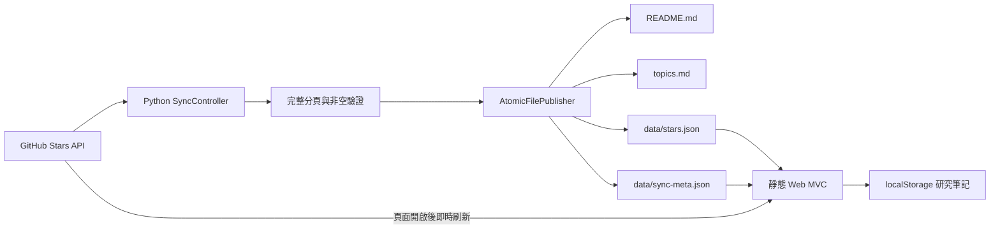
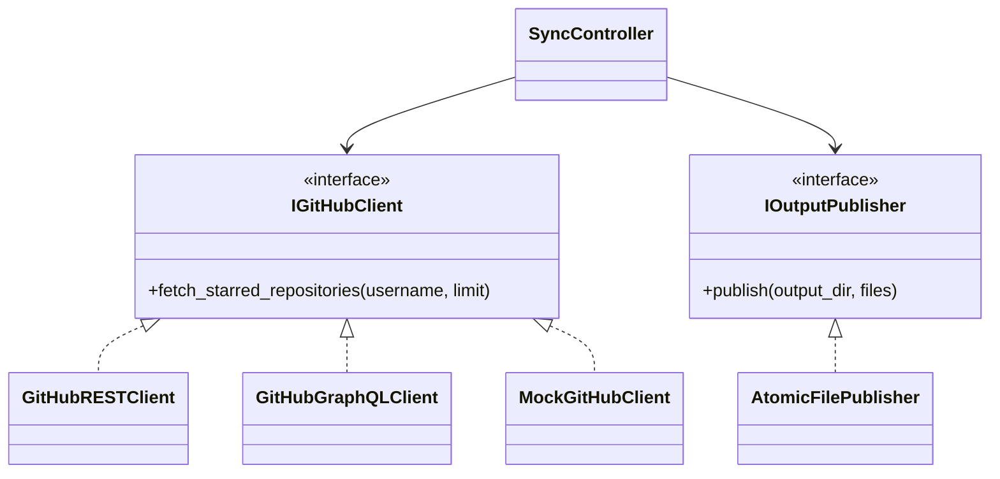

# GitHub-Star-Manager 架構設計

更新日期：2026-07-29

## 1. 系統定位與真實邊界

GitHub-Star-Manager 是 **靜態 GitHub Pages 網站 + Python 產生器**，不是持續運行的後端服務，也沒有資料庫。

系統提供兩條資料路徑：

1. **瀏覽器即時路徑**：開啟頁面後先顯示版本庫快照，再直接向 GitHub 公開 REST API 取得 `Andy87877` 當下的公開 Stars。成功時畫面標示「GitHub 即時資料」；失敗時保留快照並明確標示降級。
2. **版本庫快照路徑**：Python 同步器由本機、手動 workflow 或每 6 小時排程執行，產生 `README.md`、`topics.md`、`data/stars.json`、`data/sync-meta.json`。

因此：

- 網頁可以在使用者開啟時取得當下公開資料，但受 GitHub 未登入 API 額度、網路與 CORS 狀態影響。
- README 是「最近一次成功 workflow／本機同步的快照」，不是動態頁面。
- 本次只驗證本機程式與資料；GitHub Pages 和 workflow 必須在使用者之後 push 才會真正上線。

## 2. 系統資料流



`localStorage` 筆記只存在目前瀏覽器，不會進入 GitHub、JSON 或 Markdown。

## 3. 目錄與責任

```text
GitHub-Star-Manager/
├── app/
│   ├── models/repository.py          # 領域 Model
│   ├── services/
│   │   ├── github_client.py          # REST / GraphQL / Mock Client
│   │   ├── categorizers.py           # Language / Topic Strategy
│   │   ├── renderers.py              # Markdown / JSON View renderer
│   │   └── publisher.py              # 安全原子發布
│   └── controllers/sync_controller.py
├── css/style.css
├── data/
│   ├── stars.json                    # 可發布快照
│   └── sync-meta.json                # 時間、來源、筆數證據
├── js/
│   ├── models/StarModel.js
│   ├── views/StarView.js
│   ├── controllers/StarController.js
│   └── app.js
├── tests/*.robot
├── artifacts/                        # 本機測試輸出；不進版控
├── index.html
├── main.py
└── requirements.txt
```

## 4. MVC

### 4.1 Python 產生器

| 層 | 類別 | 責任 |
|---|---|---|
| Model | `Repository` | 封裝 repository 欄位與 JSON 命名轉換 |
| View | Markdown／JSON renderers | 將領域物件轉成 README、Topic 索引、網站資料 |
| Controller | `SyncController` | 調度 Extract → Validate → Transform → Render → Publish |

網路傳輸與檔案發布屬於 Controller 依賴的 Infrastructure Service，不塞進領域模型。

### 4.2 瀏覽器

| 層 | 類別 | 責任 |
|---|---|---|
| Model | `StarModel` | 快照／即時資料、正規化、篩選、排序、筆記與主題設定 |
| View | `StarView` | 安全 DOM 輸出、狀態、卡片、Modal、Toast、焦點 |
| Controller | `StarController` | 綁定事件、更新 Model、要求 View 重繪 |

`app.js` 只負責組裝三個物件。

## 5. OOP 與 SOLID 對應

| 原則 | 落實方式 |
|---|---|
| SRP | GitHub Client 只抓資料；Categorizer 只分類；Renderer 只格式化；Publisher 只發布 |
| OCP | 新增 Client、分類策略或輸出格式，不必修改其他具體類別 |
| LSP | REST、GraphQL、Mock 都符合 `IGitHubClient`；測試可替換實作 |
| ISP | `IGitHubClient`、`IRenderer`、`IOutputPublisher` 都是小型專用介面 |
| DIP | `SyncController` 接收抽象 Client 與 Publisher；測試注入 Empty／Mock Client |



## 6. 發布安全不變量

以下條件任一不成立，就不得覆寫有效快照：

- GitHub HTTP／GraphQL 回應成功。
- 每一頁都能完整解析；不能拿部分頁面當成功。
- repository 具備 `full_name` 與 HTTPS URL。
- 預設取得筆數大於 0。
- 所有輸出先寫入同目錄暫存檔，再以 `os.replace` 發布。
- 輸出路徑解析後必須仍在指定 `output_dir`。

Mock 測試只能輸出至 `artifacts/test-generated/`。Workflow 必須先測試，再進行真實同步，避免測試資料污染正式輸出。

## 7. 即時性與資料格式

REST 使用 `Accept: application/vnd.github.star+json`，取得：

- `starred_at`
- repository 名稱、網址、描述、主要語言、Topics
- Stars、Forks、Archived、`updated_at`

GraphQL 在 `GITHUB_TOKEN` 存在時使用 cursor pagination；無 Token 時使用公開 REST pagination。兩者輸出同一個 `Repository` Model。

### 7.1 Topic 聚焦政策

GitHub 原始 Topics 屬於高基數、低一致性的標籤資料。本次快照有 469 個不同 Topics，其中 401 個只出現一次；若全部做成目錄，導航反而失去作用。

系統將「保存」和「導航」分離：

- `data/stars.json` 與全文搜尋保存全部原始 Topics。
- `FocusedTopicPolicy` 只選擇至少涵蓋 2 個 repositories 的 Topics。
- 依涵蓋數由高到低排序，同分時依名稱排序。
- `topics.md` 與網站 Topic 控制項最多顯示前 30 個。
- 門檻與上限封裝於可替換的 `ITopicSelectionPolicy`，不寫死在 Renderer。

`data/sync-meta.json` 範例：

```json
{
  "username": "Andy87877",
  "profileUrl": "https://github.com/Andy87877?tab=stars",
  "generatedAt": "2026-07-29T04:27:28+00:00",
  "repositoryCount": 151,
  "source": "GitHub REST API",
  "isLiveSnapshot": true
}
```

## 8. UI／UX 與無障礙

- 預設僅顯示未封存專案；可切換全部或 Archived。
- 搜尋涵蓋名稱、描述、語言、Topics 與本機筆記。
- Topic 下拉可存取全部 Topic；捷徑列只呈現高頻項目。
- 提供清除篩選、結果數、即時資料來源、重新同步與空狀態。
- Cards 適合探索與閱讀描述；Table 適合掃描、比較與大量管理。
- Cards／Table 使用同一份 Model 篩選結果，切換不會清除條件，偏好儲存在瀏覽器。
- Table 提供 Repository、語言、Stars、Forks、收藏日期、狀態與筆記操作；窄螢幕使用明確的水平捲動容器。
- Modal 支援 Escape、背景點擊、焦點移入／回復、Ctrl／⌘ + Enter 儲存。
- 所有互動元件具 label／ARIA／`focus-visible`；支援 `prefers-reduced-motion`。
- 斷點 768px、480px 調整導覽、篩選、卡片與 Modal。

## 9. 自動化與驗證

Robot Framework 覆蓋：

- Language／Topic 分類與 fallback。
- Markdown／JSON renderer。
- REST Star media type 契約與 `starred_at`。
- 空資料不得覆寫。
- Mock CLI 輸出隔離。
- Workflow 先測試、後同步。
- Web 無障礙與即時資料靜態契約。
- Topic 聚焦政策與 Cards／Table 顯示契約。

此外需以真實瀏覽器驗證載入、搜尋、篩選、清除、Modal、主題與手機版。測試報告統一寫入 `artifacts/robot/`。

## 10. 安全與隱私

- 前端只存取公開 GitHub 資料，不嵌入 Token。
- Token 僅由環境變數／GitHub Actions Secret 傳入 Python。
- API 文字輸出至 HTML 前會 escape；repository URL 僅允許 HTTPS。
- 外部連結使用 `noopener noreferrer`。
- 個人筆記不上傳；CSV 由瀏覽器本機產生。
